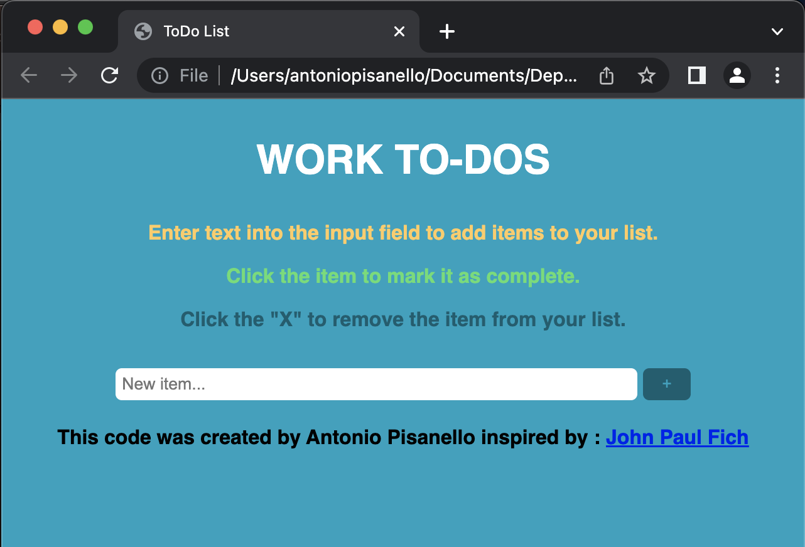

# ToDO List
## Description
Le but de cet exercice est de créer une liste de tâches à faire. L'utilisateur doit pouvoir ajouter une tâche, la supprimer et la marquer comme faite.

### Présentation
voici a quoi resemeble le site :



je vous fournis les fichiers CSS et HTML, vous n'avez qu'a coder le fichier JS.
J'ai été inspiré par le [travail de Jhon Paul Fich](https://codepen.io/JohnPaulFich/pen/MXmzzM) pour faire ce site. J'ai repris son design et son fichier HTML. Cependant la partie Javascript a totalement été remplacée.
Cette fois je vous done mon application afin que vous aillez un exemple foctionel de ce que vous devez faire.
J'ai commenteé la lige qui source votre fichier JS `todo_eleves.js` Vous devez commenter la miene `todo.obfuscated.js` et décommenté la votre. Vous pouvez a tout moment commenter la votre et décommenter la mienne pour voir l'example fonctionel.

⚠️ Vous ne devez pas modifier le fichier HTML ni le fichier CSS. Vous devez coder le fichier `todo_eleves.js` qui est le fichier JS que vous avez créé.

## Objectifs
Le but de cet exercice est de coder l'application en Javascript. Vous devez donc coder le fichier `todo.js` pour que l'application fonctionne.

## Fonctionnalités
### Ajouter une tâche
L'utilisateur doit pouvoir ajouter une tâche à la liste. Pour cela, il doit pouvoir saisir le nom de la tâche dans un champ de saisie et valider. La tâche doit alors être ajoutée à la liste.

Les taches sont uniques, si l'utilisateur ajoute une tache qui existe déjà, la foncntion doit juste l'ignorer.

Il doit pouvoir être possible d'ajouter une tâche en appuyant sur la touche `Entrée` du clavier. pour ce faire vous devez écouter l'évènement `keypress` sur le champ de saisie et si la valeure de la touche donnée par l'évènement est `Enter` vous devez ajouter la tache.
voici un code en javascript qui permet de savoir quelle touche a été pressée :

```javascript
input.addEventListener("keypress", e => {
	let _this = e.target
	if (e.key === "Enter") {
		// Ajouter la tache
	}
})
```

la ligne `let _this = e.target` permet de récupérer l'élément HTML qui a déclenché l'évènement. Ici c'est le champ de saisie. la variable `e` passée en paramètre de la fonction est l'évènement, l'évènement contient des informations sur ce qui s'est passé. vous trouverez plus d'information sur l'objet `e` [ici](https://developer.mozilla.org/fr/docs/Web/API/KeyboardEvent). Par exemple `e.key` est la touche pressée au format string.
⚠️ `e.which` ou `e.keyCode` sont les valeurs ASCII de la touche préssée.  sont des propriétés obsolètes, il faut utiliser `e.key`

### Supprimer une tâche
L'utilisateur doit pouvoir supprimer une tâche de la liste. Pour cela, il doit pouvoir cliquer sur un bouton à côté de la tâche. La tâche doit alors être supprimée de la liste. Chaques taches doit avoir son propre bouton.

### Marquer une tâche comme faite
L'utilisateur doit pouvoir marquer une tâche comme faite. Pour cela, il doit pouvoir cliquer sur la tâche. La tâche clickée doit alors être en vert. une classe CSS `done` est déjà présente dans le fichier CSS. Il suffit de l'ajouter à la tache.
Si une tâche est marquée comme "faite" et que l'utilisateur clique dessus, elle doit redevenir "à faire". C'est à dire que la classe `done` doit être retirée.

### Sauvegarder les tâches
Finalement, lorsque l'utilisateur ajoute, supprime ou marque une tâche comme faite, la liste doit être sauvegardée dans le `localStorage`. Ainsi, lorsque l'utilisateur revient sur la page, les tâches doivent être affichées.

## Hint
- Vous pouvez utiliser la fonction `document.createElement()` pour créer un élément HTML. et `document.appendChild()` pour l'ajouter à un autre élément HTML. Par exemple :

```javascript
const li = document.createElement("li")
li.addEventListener("click", e => {
  // ...
})
const dBtn = document.createElement("button")
dBtn.classList.add("deleteButton");
dBtn.appendChild(document.createTextNode("X"));
dBnt.addEventListener("click", e => {
  // ...
})
li.appendChild(dBtn)
```
- Pour stocker un objet dans le `localStorage` vous devez le convertir en string. Pour cela vous pouvez utiliser la fonction `JSON.stringify()`. Pour récupérer un objet du `localStorage` vous devez le convertir en objet Javascript. Pour cela vous pouvez utiliser la fonction `JSON.parse()`. Par exemple :

```javascript
const obj = {a: 1, b: 2}
localStorage.setItem("obj", JSON.stringify(obj))
const obj2 = JSON.parse(localStorage.getItem("obj"))
```
