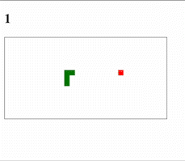

# **Snake**
## **Presentation**
Le but de ce projet est de créer un jeu de snake en utilisant le DOM. Vous pouvez faire ce projet seul ou en groupe de 2. Le jeu se joue sur un navigateur web à l'aide des flèches du clavier. Le but du jeu est de manger le plus de pommes possible sans se mordre la queue ou sortir du terrain de jeu. Le jeu se termine lorsque le serpent se mord la queue ou sort du terrain de jeu. Le score est le nombre de pommes mangées.



## **Conception**
### **Fichiers fournis**
Les fichiers suivants sont fournis :
- `index.html` : le fichier html qui contient le terrain de jeu et l'affichage du score. ce fichier contient aussi les liens vers les fichiers css et js. Comme pour le projet to-do list, le sourcing de votre script sera commenté et vous devrez le décommenter pour que votre code soit exécuté.
- `style.css` : le fichier css qui contient le style du terrain de jeu et du score.
- `snake_eleves.js` : le fichier js qui contient le squelette de votre code. Vous devrez compléter ce fichier pour que le jeu fonctionne.
- `snake.obfuscated.js` : le fichier js qui contient le code du jeu. Ce fichier est obfusqué, c'est à dire que le code est rendu illisible. Il sert d'exemple pour que vous aillez un snake fonctionnel.

### Terrain de jeu
Le terrain de vous est donné dans le fichier `index.html`. Pour créer le terrain de jeu on utilisera la balise `<canvas>` de taille 300x150. Le body du snake ainsi que la pomme seront afficher comme étant des carrés de 10x10. Le terrain de jeu sera donc composé de 30x15 carrés. Le terrain de jeu sera affiché en haut de la page avec le score au dessus.

**hint :** utilisez la fonction `fillRect` du contexte 2D du canvas pour dessiner les carrés. La fonction `fillRect` prend 4 paramètres : la position x, la position y, la largeur et la hauteur du carré. Ici la largeur et la hauteur seront toujours de 10, une constante est définie dans le code `BLOCK_SIZE`.

Le serpent et la pomme sont afficher avec deux couleurs différentes. La couleur du serpent est verte et est définie dans le code avec la constante `SNAKE_COLOR` et la couleur de la pomme est rouge et est définie dans le code avec la constante `FOOD_COLOR`.

La procédure pour afficher un carré dans canvas est la suivante :
```javascript
// on récupère le contexte 2D du canvas
const ctx = canvas.getContext('2d');
// on définit la couleur du carré
ctx.fillStyle = 'green';
// on dessine le carré
ctx.fillRect(0, 0, 10, 10);
```

**Note :** le context 2D du canvas est une constante globale, mais elle peut être passée en paramètre a une fonction.

### **Structure de données**
#### **Le serpent**
Le serpent sera définit grâce à une classe `Snake`. Cette classe contiendra les informations suivantes :
- `body` : un tableau qui contient les coordonnées de chaque partie du corps du serpent. Les coordonnées sont des objets de la forme `{x: 0, y: 0}`. La tête du serpent sera le premier élément du tableau et la queue sera le dernier élément du tableau.
- `direction` : un objet qui contient la direction du serpent. La direction est un string qui peut prendre les valeurs suivantes : `up`, `down`, `left` et `right`. Cependant dans le code des constantes definissent ces valeurs. 

Le constructeur de la classe st le suivant :
```javascript
class Snake {
  #body
  #direction

  constructor(blockSize) {
    this.#body = [
      { x: 50, y: 50 },
      { x: 40, y: 50 },
      { x: 30, y: 50 },
    ];
    this.#direction = RIGHT;
    this.blockSize = blockSize;
  }

  // ...

  // Getter
  get head() {
    return {...this.#body[0]}
  }
}
```
Cela signifie que le serpent est initialement composé de 3 carrés et qu'il se déplace vers la droite. Notez qu'ici blockSize est passé au constructeur, vous n'êtes pas obligé de faire comme ça, vous pouvez utiliser la constante `BLOCK_SIZE` directement.

**/!\ Attention** : le getter head() ici vous est donné, il ne faut pas le modifier. Il permet de récupérer la tête du serpent. Il est important de noter que le getter retourne une copie de la tête du serpent et non la tête du serpent elle même. Cela permet d'éviter que le code extérieur modifie la tête du serpent. Si vous devez utiliser la veuleur de la tête du sperpent utilisez le getter `head` et non la variable `#body[0]`.

Il faudra implémenter les méthodes suivantes :
- `move()` : cette méthode permet de faire avancer le serpent d'un pas dans la direction courante. Pour cela il faudra ajouter un carré à la tête du serpent et supprimer le dernier carré de la queue du serpent. Pour ajouter un carré à la tête du serpent il faudra utiliser la méthode `unshift` du tableau. Cette méthode permet d'ajouter un nouvel éléement en début de tableau. Pour supprimer le dernier carré de la queue du serpent il faudra utiliser la méthode `pop` du tableau. L'élément à ajouter est un objet jaavscript sous la forme `{x:..., y:...}` qui correspond aux coordonnées du nouveau carré. Pour calculer les coordonnées du nouveau carré il faudra utiliser les coordonnées courrantes de la tete et changer la valeur `x` ou `y` en fonction de la direction. Par exemple si la direction est `right` il faudra ajouter un carré à droite de la tête du serpent, donc il faudra ajouter 10 (`BLOCK_SIZE`) à la valeur `x` de la tête du serpent. 
- `setDirection(direction)` : cette méthode permet de changer la direction du serpent. Elle prend en paramètre un string qui peut prendre les valeurs suivantes : `up`, `down`, `left` et `right`. Cependant dans le code des constantes definissent ces valeurs. Cette méthode ne fait que changer la valeur de la propriété `direction` du serpent. Attention à ne pas changer la direction du serpent si la nouvelle direction est opposée à la direction courante. Par exemple si la direction courante est `right` on ne peut pas changer la direction en `left` car le serpent se mordrait la queue.
- `grow()` : cette méthode permet de faire grandir le serpent. Pour cela il faudra ajouter un carré à la queue du serpent. Autrement dit, on ne supprime pas la queue quand on grandit.
- `checkCollision()` : cette méthode permet de savoir si on collisionné avec la pomme. Pour cela il faudra comparer les coordonnées de la tête du serpent avec les coordonnées de la pomme. Si les coordonnées sont égales alors on collisionne avec la pomme. Cette méthode retourne un booléen qui vaut `true` si on collisionne avec la pomme et `false` sinon.
- `checkSelfCollision()` : cette méthode permet de savoir si on collisionne avec le corps du serpent. Pour cela il faudra comparer les coordonnées de la tête du serpent avec les coordonnées de chaque partie du corps du serpent. Si les coordonnées sont égales alors on collisionne avec le corps du serpent. Cette méthode retourne un booléen qui vaut `true` si on collisionne avec le corps du serpent et `false` sinon.
- `checkBorderCollision()` : cette méthode permet de savoir si on collisionne avec les bords du terrain de jeu. Pour cela il faudra comparer les coordonnées de la tête du serpent avec les coordonnées des bords du terrain de jeu. Une collision a lieu si la tête est `<= 0` en `x` ou `>= GAME_WIDTH` en `x` ou `<= 0` en `y` ou `>= GAME_HEIGH` en `y`. Cette méthode retourne un booléen qui vaut `true` si on collisionne avec les bords du terrain de jeu et `false` sinon.
- `checkGameOver()` : cette méthode permet de savoir si on collisionne avec le corps du serpent ou avec les bords du terrain de jeu. Pour cela il faudra utiliser les méthodes `checkSelfCollision()` et `checkBorderCollision()`. Cette méthode retourne un booléen qui vaut `true` si on collisionne avec le corps du serpent ou avec les bords du terrain de jeu et `false` sinon.
- `draw()` : cette méthode permet de dessiner le serpent dans le canvas. Pour cela il faudra utiliser la fonction `fillRect` du contexte 2D du canvas. La fonction `fillRect` prend 4 paramètres : la position x, la position y, la largeur et la hauteur du carré. Ici la largeur et la hauteur seront toujours de 10 (`BLOCK_SIZE`). Pour dessiner le serpent il faudra parcourir le tableau `body` et dessiner chaque carré du serpent. Le serpent sera dessiné de couleur verte définie dans le code avec la constante `SNAKE_COLOR`.

#### **La pomme**
La pomme sera définit grâce à une classe `Food`. Cette classe contiendra les informations suivantes :
- `x` : une variable qui contient la position x de la pomme.
- `y` : une variable qui contient la position y de la pomme.
cette fois c'est a vous de créer le constructeur de la classe. Notez qu'au début de la partie la pomme est placée aléatoirement dans le terrain.

Il faudra implémenter les méthodes suivantes :
- `draw()` : cette méthode permet de dessiner la pomme dans le canvas. Pour cela il faudra utiliser la fonction `fillRect` du contexte 2D du canvas. La fonction `fillRect` prend 4 paramètres : la position x, la position y, la largeur et la hauteur du carré. Ici la largeur et la hauteur seront toujours de 10 (`BLOCK_SIZE`). Pour dessiner la pomme il faudra utiliser les variables `x` et `y` de la pomme. La pomme sera dessinée de couleur rouge définie dans le code avec la constante `FOOD_COLOR`.
- `makeFoodItem()` : La première chose à faire ici, c'est de choisir un point aléatoire. je vous donne la fonction suivante :
```javascript
const suggestedPoint = () => {
  const maxBlocksX = canvasWidth / this.blockSize;
  const maxBlocksY = canvasHeight / this.blockSize;
  const x = Math.floor(Math.random()*maxBlocksX)*this.blockSize;
  const y = Math.floor(Math.random()*maxBlocksY)*this.blockSize;
  return [x, y];
}
```
Cette fonction retourne un tableau de deux éléments qui correspond à un point aléatoire dans le terrain de jeu. Il faudra ensuite vérifier si la pomme n'est pas placée sur le serpent. Si la pomme est placée sur le serpent il faudra rappeler la fonction `suggestedPoint()` pour avoir un nouveau point aléatoire. Une fois que la pomme est placée sur le terrain il faudra mettre à jour les variables `x` et `y` de la pomme avec les valeurs du point aléatoire.

#### **Les constantes**
Les constantes sont des variables qui ne peuvent pas être modifiées. Elles sont définies au début du code. Elles permettent de rendre le code plus lisible et plus facile à modifier. Dans notre cas nous avons les constantes suivantes :
- `canvas` : la variable qui contient le canvas.
- `ctx` : la variable qui contient le contexte 2D du canvas.
- `BLOCK_SIZE` : la taille d'un carré du serpent ou de la pomme.
- `GAME_WIDTH` : la largeur du terrain de jeu.
- `GAME_HEIGHT` : la hauteur du terrain de jeu.
- `GAME_SPEED` : la vitesse du jeu. C'est le nombre de millisecondes entre chaque mise à jour du jeu.
- `LEFT` : la valeur string "left" qui définit direction gauche.
- `RIGHT` : la valeur string "right" qui définit direction droite.
- `UP` : la valeur string "up" qui définit direction haut.
- `DOWN` : la valeur string "down" qui définit direction bas.
- `SNAKE_COLOR` : la couleur du serpent.
- `FOOD_COLOR` : la couleur de la pomme.

#### **Les variables**
Les variables permettent de stocker des informations, des états du jeu. Dans notre cas nous avons les variables suivantes :
- `snake` : la variable qui contient le serpent.
- `food` : la variable qui contient la pomme.
- `score` : la variable qui contient le score du joueur.

### **Le jeu**
Le jeu est défini dans un intervalle de temps. Cet intervalle de temps est défini par la constante `GAME_SPEED`. A chaque intervalle de temps on met à jour le jeu. Pour mettre à jour le jeu il faut :
- Effacer le canvas.
- Déplacer le serpent.
- Vérifier si le serpent a collisionné avec la pomme.
- Dessiner le serpent.

Pour changer la direction du serpent il faut utiliser les touches du clavier. Pour cela il faut utiliser l'événement `keydown` du document. Cet événement est déclenché à chaque fois qu'une touche du clavier est enfoncée. Il faudra donc ajouter un écouteur d'événement sur le document pour écouter l'événement `keydown`. Lorsque l'événement `keydown` est déclenché il faudra récupérer la touche du clavier qui a été enfoncée et changer la direction du serpent en fonction de la touche du clavier. Pour récupérer la touche du clavier il faudra utiliser la propriété `key` de l'événement. Cette propriété contient la touche du clavier qui a été enfoncée. Vous pouvez utiliser cette méthode : 
```javascript
document.addEventListener("keydown", handleKeyDown);

function handleKeyDown(event) {
  switch (event.key) {
    case "ArrowLeft":
      // TODO : changer la direction du serpent vers la gauche
      break;
    case "ArrowUp":
      // TODO : changer la direction du serpent vers le haut
      break;
    case "ArrowRight":
      // TODO : changer la direction du serpent vers la droite
      break;
    case "ArrowDown":
      // TODO : changer la direction du serpent vers le bas
      break;
  }
}
```


